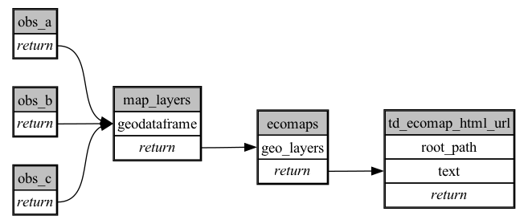

```
# [generated]
# by = { compiler = "ecoscope-workflows-core", version = "9999" }
# from-spec-sha256 = "f6384cd0eb4688500ebe7cdcebbd33701ed8f127959ea65f15c2d45cff6c1ac6"

```
# ecoscope-workflows-mode-map-workflow


