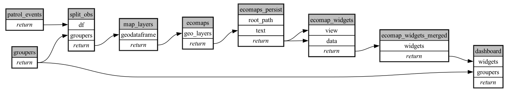

```
# [generated]
# by = { compiler = "ecoscope-workflows-core", version = "9999" }
# from-spec-sha256 = "9ffe7e163c247511be3e17d2cb0e44fe511fc12b67f8b18189a0078542e757ea"

```
# ecoscope-workflows-mode-mapvalues-workflow


