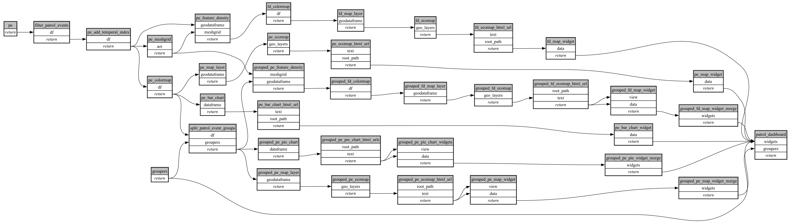

```
# [generated]
# by = { compiler = "ecoscope-workflows-core", version = "9999" }
# from-spec-sha256 = "5f829d8715e0d1d99e9bd17ffdbd4cdf3add65c43661fae0725e495fc4d20c66"

```
# ecoscope-workflows-patrol-events-workflow


