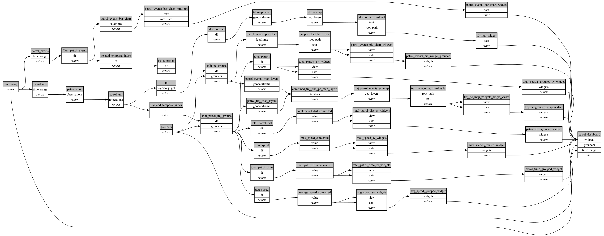

```
# [generated]
# by = { compiler = "ecoscope-workflows-core", version = "9999" }
# from-spec-sha256 = "ee0b2d2b878db6ec19497e572aaa0c169cab2c454835c3f0bcfa901573cd6bf5"

```
# ecoscope-workflows-patrols-workflow


