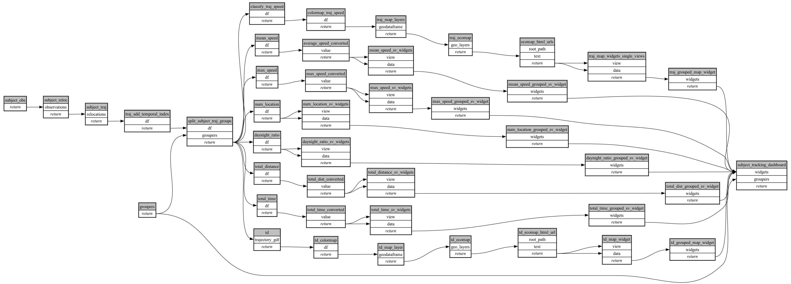

```
# [generated]
# by = { compiler = "ecoscope-workflows-core", version = "9999" }
# from-spec-sha256 = "1bba0e65ec660ba6386aa5c8a7c29109ccb34607bd2f62e3aed4d8f3b2a9ef10"

```
# ecoscope-workflows-subject-tracking-workflow


