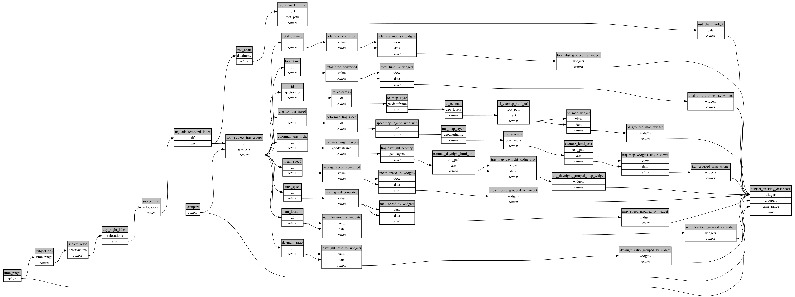

```
# [generated]
# by = { compiler = "ecoscope-workflows-core", version = "9999" }
<<<<<<< HEAD
# from-spec-sha256 = "030474a8999b732797c67f96a4e84066b843fa1b916296fe83f432ffa7d08480"
=======
# from-spec-sha256 = "a45a987fc5f35a6d3f9e1ac858aa050ef6afeca2bb96c8deda154a804dc69253"
>>>>>>> d90c2c5 (recompile)

```
# ecoscope-workflows-subject-tracking-workflow


